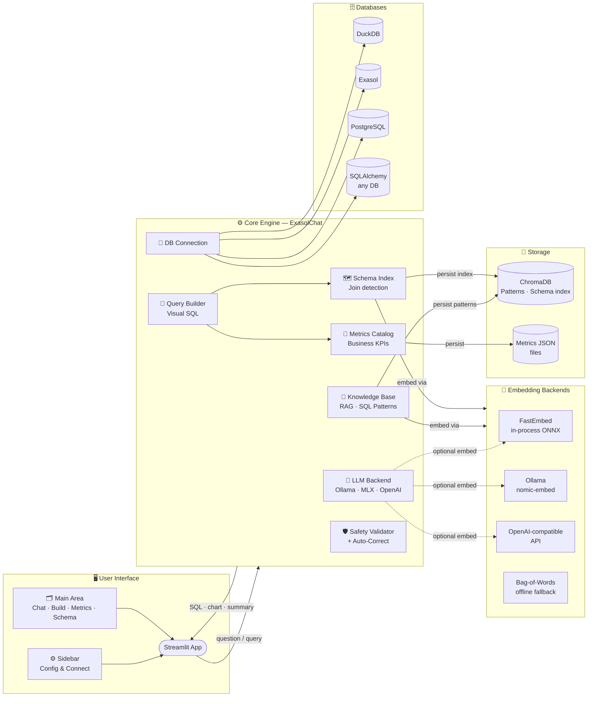

# ⚡ exachat — Architecture

## Component Responsibilities

| Component | Role |
|---|---|
| **Streamlit App** | Web UI — chat, visual builder, metrics explorer, schema map |
| **LLM Backend** | Text-to-SQL generation, summaries, chart suggestions, follow-ups |
| **Knowledge Base** | RAG over 200+ domain SQL patterns (ChromaDB-backed) |
| **Schema Index** | Per-table semantic retrieval for large schemas (15+ tables) |
| **Query Builder** | Point-and-click SQL without LLM, driven by Metrics Catalog |
| **Metrics Catalog** | Business metric definitions with SQL templates and dimensions |
| **Safety Validator** | Risk classification + auto-correct retry loop (up to 3 attempts) |
| **DB Connection** | Unified connector for DuckDB, Exasol, PostgreSQL, SQLAlchemy |
| **Embedding Backends** | FastEmbed (default, in-process) · Ollama · OpenAI-compat · Bag-of-Words |
